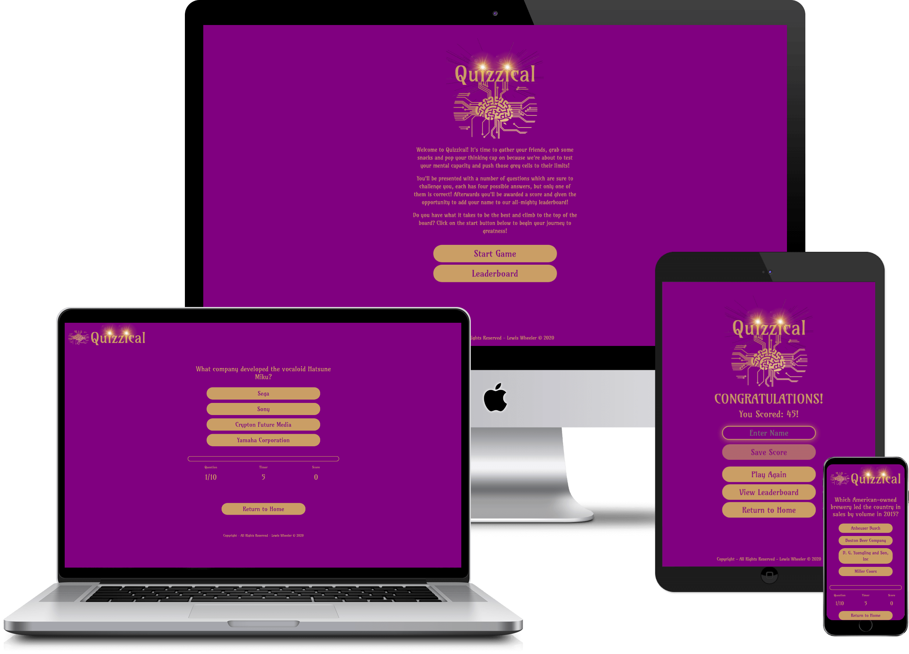

# **QUIZZICAL**

Quizzical is a fun, exciting, general knowledge based quiz game.

The Quizzical website's main goal is to provide the user with a pleasureable experience,
one that's memorable and has great replay value.

Quizzical is aimed at both adults and children alike.

## **TABLE OF CONTENTS**

1. [Live Demo](#live-demo)                                     
2. [UX](#ux)
    * [User Stories](#stories)
    * [Strategy](#strategy)
    * [Scope](#scope)
    * [Structure](#structure)
    * [Skeleton](#skeleton)
        * [Sketches](#sketches)
        * [Wireframes](#wireframes)
        * [Mockups](#mockups)
    * [Surface](#surface)

3. [Existing Features](#existing)
    * [Navigation](#navigation)
    * [Home](#home)
    * [Questions](#questions)
    * [Completed](#completed)
    * [Leaderboard](#leaderboard)

4. [Features left to Implement](#features-left)
5. [Technologies](#technologies)
6. [Testing](#testing)
    * [Home](#home-test)
    * [Questions](#about-test)
    * [Completed](#gallery-test)
    * [Leaderboard](#classes-test)
    * [Footer](#foot-test)
    * [Display Testing](#display-test)
    * [Image Size Reduction](#size)
    * [Spelling & Grammar](#spell)
    * [Code Validation](#validate)

7. [Deployment](#deployment)
    * [Configure Github Pages](#pages)
    * [Cloning Repository](#cloning)

8. [Credits](#credits)
    * [Content](#content)
    * [Media](#media)
    * [Acknowledgements](#thanks)

---
## **LIVE DEMO** 

Please feel free to delve into a demo of Quizzical's website.

You can live demo Quizzical's website here: [Quizzical](https://ENTER WEBSITE HERE).

---
## **UX** 

The user experience (UX) is what a user of a particular product experiences when using that product. A UX designer's job is thus to create a product that 
provides the best possible user experience. We're going to provide some insight into the UX process here, focusing on the important Who, What and How?

Quizzical, as previously stated, is a general knowledge based quiz game that's sole purpose is to not only provide a fun, exciting, memorable experience for
both adults and children alike, but to teach and broaden people's horizons. The hope is that people can walk away feeling like they've learnt something new. 
Quizzical also has a competitive side to it, friends and family can compete to place their name at the top of Quizzical's leaderboard. Do you have what it takes?
Carry on below and read some of Quizzical's user stories to get a feel for what people have been saying about Quizzical.

---
### **USER STORIES** 

>  * I thought this quiz was great! Really tested my knowledge! - Lindsay W. 

>  * I love the leaderboard aspect, I wish the leaderboard saved over the cloud though! Wanna play with my mates! - John P.

>  * Played this with my 10 year old, she did better than me! Great family fun! - Mandy S.

>  * Love the colours! My favourite colours! - Ruby R.

>  * Great game. Wish we had a little longer to answer each question... - Ben D.

---
### **STRATEGY** 

* The strategy of the Quizzical website is to entertain and educate users.

---
### **SCOPE** 

*  The scope of Quizzical is to provide a flawless user experience straight from the get-go. We want users to be highly entertained in a socially competitive
environment whilst absorbing information they may not have encountered before. Ultimately we want users to return time and time again, not only climb the
leaderboard and show off their new-found knowledge, but to learn something new every time.

---
### **STRUCTURE** 

* Each page will have a Quizzical logo situated at the top of the screen whether it's in the middle or located to the left. Each page will have an identicle
footer which contains copyright information and a link to the developer's LinkedIn profile. There are four pages in total and they are the Home page, Questions
page, Completed page and Leaderboard page. All questions will be displayed within one HTML page which will be randomly generated by the [Open Trivia Database](https://opentdb.com/)
API. Each question will be navigated through via JavaScript. There are ten questions in total and there are four possible answers to each question. There is
a progress bar located directly beneath the questions which will automatically fill as each question is answered. Below this there is a question counter, a 
timer and a score tally. These will all update automatically with the use of JavaScript as the user completes each question. Towards the bottom of the pages
a there will be a "Return Home" button which users can click in order to return to the Home page. The Completed page has large text indicating that the quiz 
has been completed. There is a name field and a save button below so that users can save their scores and upload them to the leaderboard. There are also a number
of buttons that will navigate to the different pages of the Quizzical website. Finally the leaderboard will have a main title. The rest of the page will Initially
display bare. As users upload their scores, a table will appear and populate user's names and their scores.

---
### **SKELETON** 

Quizzical's website started on a piece of paper. Sketches were drawn out and a decent design was soon ready to take the leap into the digital world.
Below you shall find some images of the original sketches used to help develop this project.

#### *Sketches* 

* [Home Page Sketch](assets/images/readme/ms2-sketch-home.jpg)

* [Questions Page Sketch](assets/images/readme/ms2-sketch-questions.jpg)

* [Completed Page Sketch](assets/images/readme/ms2-sketch-completed.jpg)

* [Leaderboard Page Sketch](assets/images/readme/ms2-sketch-leaderboard.jpg)

After drawing up the sketches it was time to get them onto the screen. To do this a wireframe was created using Balsamiq Wireframes 4.
Wireframes are used to display what the creator ultimately envisions the website to look like, roughly! It acts as one of the first stepping stones
of the journey. Please find below the original Wireframes for Quizzical's project.

#### *Wireframes* 

* [Home Page Wireframe](assets/images/readme/ms2-wireframe-home.png)

* [Questions Page Wireframe](assets/images/readme/ms2-wireframe-questions.png)

* [Completed Page Wireframe](assets/images/readme/ms2-wireframe-completed.png)

* [Leaderboard Page Wireframe](assets/images/readme/ms2-wireframe-leaderboard.png)

* [Mobile Home Page Wireframe](assets/images/readme/ms2-mobile-wireframe-home.png)

* [Mobile Questions Page Wireframe](assets/images/readme/ms2-mobile-wireframe-questions.png)

* [Mobile Completed Page Wireframe](assets/images/readme/ms2-mobile-wireframe-completed.png)

* [Mobile Leaderboard Page Wireframe](assets/images/readme/ms2-mobile-wireframe-leaderboard.png)

#### *Mock Ups* 

Finally with the basics down on paper and screen, it was time to start shaping things up. After wireframes, it's time to take things a little more
seriously. Enter Adobe XD. Adobe XD is a powerful piece of software designed to assist artists worldwide. More detailed designs are now progressed, 
and sketches etc.. are now a thing of the past! If you scan down slightly you will find links to Quizzical's Mock-Ups. You can clearly see how the 
project has evolved.

* [Home Page Mockup](assets/images/readme/ms2-mockup-home.png)

* [Questions Page Mockup](assets/images/readme/ms2-mockup-questions.png)

* [Completed Page Mockup](assets/images/readme/ms2-mockup-completed.png)

* [Leaderboard Page Mockup](assets/images/readme/ms2-mockup-leaderboard.png)

* [Mobile Home Page Mockup](assets/images/readme/ms2-mobile-mockup-home.png)

* [Mobile Questions Page Mockup](assets/images/readme/ms2-mobile-mockup-questions.png)

* [Mobile Completed Page Mockup](assets/images/readme/ms2-mobile-wireframe-completed.png)

* [Mobile Leaderboard Page Mockup](assets/images/readme/ms2-mobile-mockup-leaderboard.png)

---
### **SURFACE** 

The colour scheme chosen for this website offers fluorescent, striking colours.
There may only be two colours (Purple & Gold) but they're sure to impress!
This was chosen because of the colours' positive vibe and feel-good effect.

| **Colour Name**   | **Colour RGB Code**    
| -------------     |:-------------:| 
| Purple            |#800080
| Custom Gold       |#CA9E65

 * The font used throughout Quizzical's website is Google font's Amarante - [Google Fonts' - Amarante](https://fonts.google.com/specimen/Amarante?query=Amarante).

 * If at any point a browser cannot support the Amarante font, the browser will fall back on Roboto - [Google Fonts' - Roboto](https://fonts.google.com/specimen/Roboto?query=roboto).

---
 ## **EXISTING FEATURES** 

### **NAVIGATION** 

* All pages feature at least one navigation button. The Home page presents the user with two navigation buttons, the "Start Game" button and the "View Leaderboard" button.
The buttons are fairly large and easily visible. The Questions page offers the user the ability to exit the game and return to the Home page using the "Return to Home"
button. Again this button is clearly visible toward the bottom of the page. The Completed page has slightly more options in terms of navigation. The first navigation 
button the user is presented with is the "Save Score" button, this button however, is disabled. The "Save Score" button has been disabled to prevent users being able
to save their score without entering a name into the "Enter Name" field. Once a user has entered their name, the "Save Score" button becomes available to click. Below
the "Save Score" button there are three more buttons, "Play Again", "View Leaderboard", and "Return to Home". The "Play Again" button will instantly direct the user to a 
new game of Quizzical. The "View Leaderboard" button will direct the user to view the Leaderboard page of Quizzical's website. Finally the "Return to Home" button will 
take the user back to Quizzical's Home page. To summarise, no matter where the user is within Quizzical's website, they shouldn't have any problem navigating themselves around.

### **HOME PAGE** 

* The Home page displays a custom made Quizzical logo image developed using Adobe XD. The Home page also includes three paragraphs of text providing information 
to the user. This text welcomes the user, gives a brief description about that they are about to do, and gives them slight encouragement.

### **QUESTIONS PAGE** 

* The Questions page displays a slightly different logo image situated to the top left hand side of the screen. This image uses more width rather than height so that
not too much verticle screen space is taken up. Similarly this logo image was developed using Adobe XD. The first thing you should notice is the questions displayed
on the Questions page. The questions themselves are displayed in a large font in gold text against a purple background, keeping to the theme of the Quizzical website.
Below the question the user will be presented with four possible answers each resembling a clickable button, much like those discovered on the Home page. When a user 
hovers their mouse over an answer button, the button will have a shine effect, this shine effect is called box-shadow. Box-shaow is highly appealing to the eye and
gives the user a better user experience. Below the answer buttons there is a progress bar. The progress bar is a visual interpretation of how far through the user is
in their game. As a user progresses through the game, the progress bar will fill. There are ten questions within the Quizzical game therefore the progress bar will fill
ten percent every time a question is answered. The progress bar has a gold border and a purple background, it fills with gold as the game progresses, keeping to the theme
of the website. South of the progress bar the user is presented with three vital pieces of information. The first piece of information is the question counter. The question
counter informs the user which question they are currently on (out of 10). This counter will increase as the game goes on. The second piece of information is the timer.
The timer is set to ten seconds which means that each user has a maximum of ten seconds to answer any question. If a user cannot answer a question in time then points will
be deducted and the next question will be populated. The third and final piece of information is the score tally. Users will be awarded ten points for each correct answer
but three points shall be decuted for any incorrect answer the user may accumulate. This will be automatically updated with JavaScript code as the game is played.
The point system is a key feature of the Quizzical website. It enables key replay value and competitiveness. 

### **COMPLETED PAGE** 

* The completed page has the same logo as the Home page, situated in the middle of the page. This is to grab the user's attention. The Completed page is presented to a user 
when they have answered all ten questions either correctly or incorrectly. During the course of the game, as mention previously, a user accumulates points depending on whether 
they score a correct answer or an incorrect answer. Ten points for correct, minus three for incorrect. This score is tallied up and presented to the user with a message of 
congratulations. Below the awarded points and congratulations message the user is presented with an "Enter Name" field, this field allows a user to enter their own name so that 
they can ultimately save their awarded score onto the Quizzical leaderboard. Below is a "Save Score" button as mentioned in the Navigation section of this document. Below are 
three navigation buttons which allow the user to navigate whereever they wish to go, whether it be to "Play Again", "View Leaderboard", or "Return to Home". Each of these 
buttons are again mentioned in the navigation section of this document.

### **LEADERBOARD PAGE** 
 
 * The leaderboard page its logo situated to the top left hand side of the screen, similar to the Questions page. This image uses more width rather than height so that
not too much verticle screen space is taken up. the logo The Leaderboard page is one key element which provides the user with great replay value. The goal of Quizzical's 
leaderboard is to offer the user the chance to compete against family and friends and place their name at the top of the board. Each score will be mathmatically decided, 
sorted, and displayed within an attractive table keeping the same theme as the rest of Quizzical's website. Initially there will be no table to display, but as users start 
to complete the quiz and upload their score to local storage, the leaderboard table will begin to populate information. The information that is held and displayed will be 
the users name and score only. Finally, as mentioned in the navigation section of this ducument, there is a "Return to Home" button located at the bottom of the Leaderboard page.

